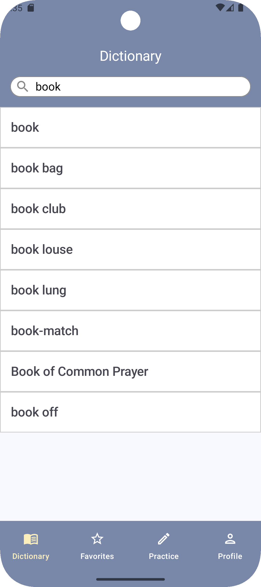
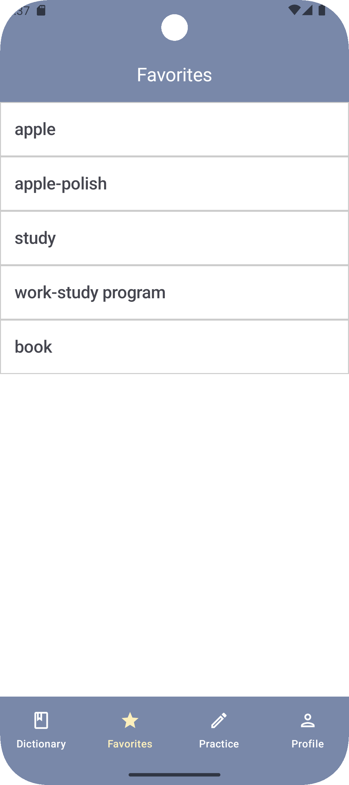
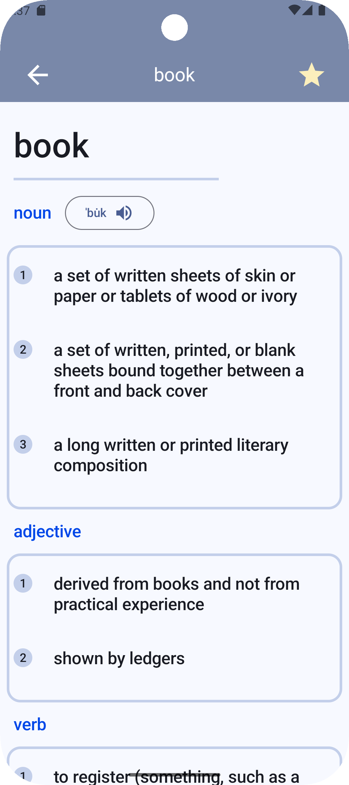
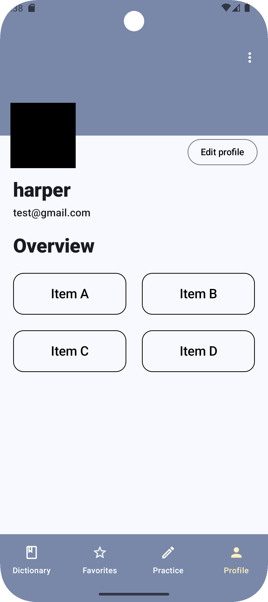
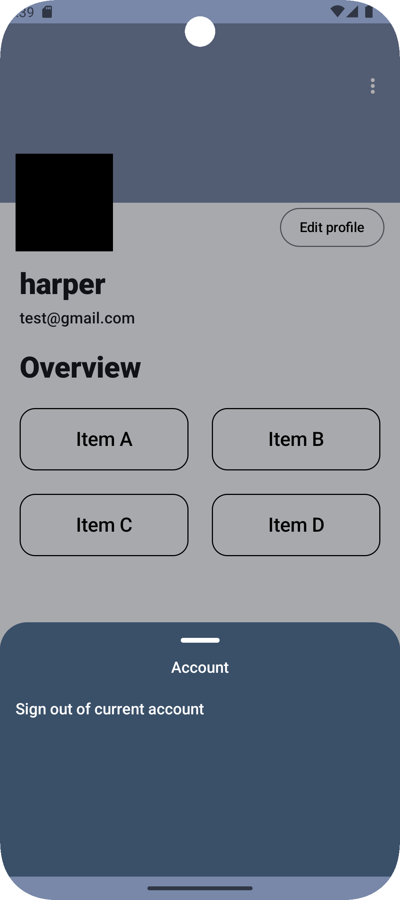
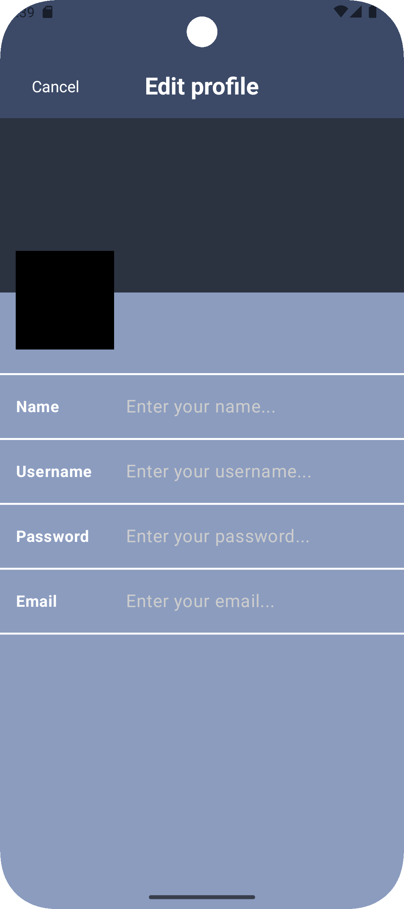
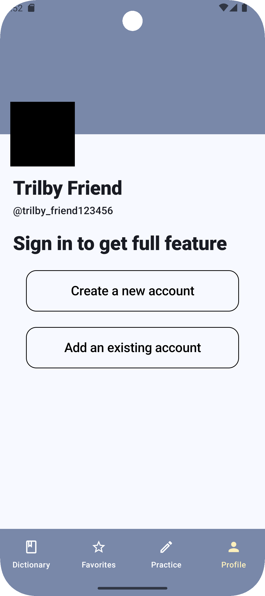
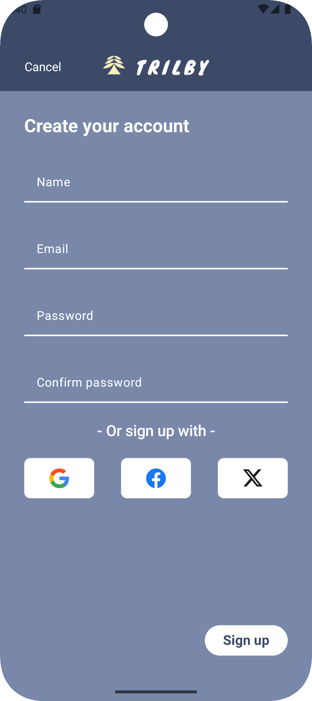
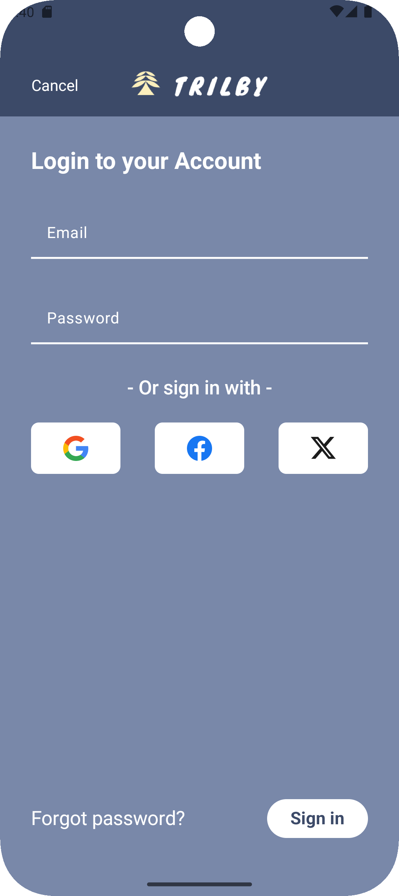

# Trilby

Build a vocabulary lookup app using the API provided by Merriam-Webster. In addition to basic word search, storage, and pronunciation features, the app is also expected to include word review and quiz functionalities (not yet implemented).

## Trilby UI

|  |  |  |
|------------------------------------|---------------------------------------|----------------------------------------------------|

|  |  |  |
|------------------------------------|---------------------------------------|----------------------------------------------------|

|  |  |  |
|------------------------------------|---------------------------------------|----------------------------------------------------|
